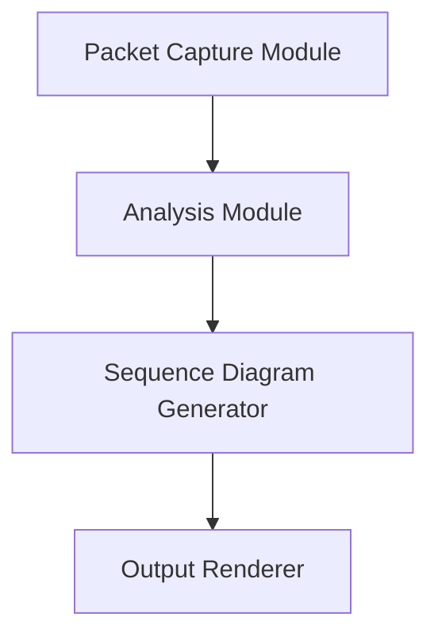
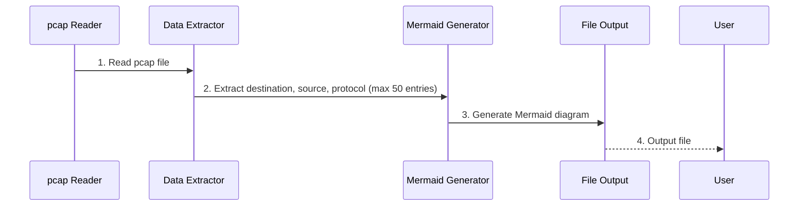

# Design
This document provides a design overview of the packet_sequence tool, including its architecture, components, and data flow.  
It is intended for developers who want to understand the internal workings of the tool and how to extend or modify it.

## Architecture
The packet_sequence tool is designed to convert tcpdump files into sequence charts.

### Components

### Data Flow
1. **Reading pcap file**  
   The tool reads data from a pcap file.

2. **Data Extraction**  
   From the pcap file, information such as destination, source, and protocol is extracted.  
   This process extracts up to 50 entries per output file. It continues to extract until the end of the file is reached.
   Future updates will allow for selecting and adding more parameters.

3. **Mermaid Diagram Generation**  
   The extracted information is used to generate a sequence diagram using Mermaid syntax.

4. **File Output**  
   The generated Mermaid content is then output to a file.

