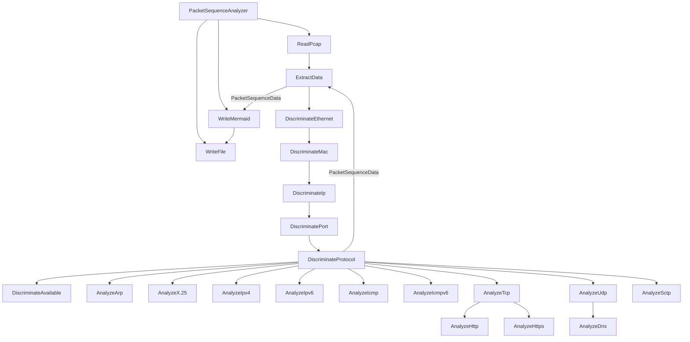

# API ドキュメント
このドキュメントは、`packet_sequence ツールの API リファレンス` を提供し、`関数の説明`、`パラメーター`、および `戻り値` について記載しています。  
ツールの内部動作や拡張・修正を検討する開発者を対象としています。

## リファレンスフォーマット
```bash
#############
# クラス名: EX_class
# 関数名: EX_function
# 説明: EX_description
# パラメーター:
#   - param1: EX_param1
#   - param2: EX_param2
# 戻り値: EX_return_value
#############
```
## クラス一覧
### 共通クラス
- `PacketSequenceAnalyzer` - 動作部分をまとめたクラス
- `ReadPcap` - pcap ファイルを読み込むクラス
- `ExtractData` - pcap ファイルからデータを抽出するクラス
- `DiscriminateProtocol` - プロトコルを判別するクラス
- `DiscriminateEthernet` - Ehternetを判別するクラス(VLANタグを含む)
- `DiscriminateIp` - IPを判別するクラス
- `DiscriminateMac` - MACを判別するクラス
- `DiscriminatePort` - ポートを判別するクラス
- `DiscriminateAvailable` - 使用可能なプロトコルを判別するクラス
- `WriteMermaid` - Mermaid 記法で出力するクラス
- `WriteFile` - ファイルに出力するクラス
### L2プロトコル
- `AnalyzeArp` - ARP内の詳細情報を解析するクラス
- `AnalyzeX.25` - X.25内の詳細情報を解析するクラス
### L3プロトコル
- `AnalyzeIpv4` - IPv4内の詳細情報を解析するクラス
- `AnalyzeIpv6` - IPv6内の詳細情報を解析するクラス
- `AnalyzeIcmp` - ICMP内の詳細情報を解析するクラス
- `AnalyzeIcmpv6` - ICMPv6内の詳細情報を解析するクラス
### L4プロトコル
- `AnalyzeTcp` - TCP内の詳細情報を解析するクラス
- `AnalyzeUdp` - UDP内の詳細情報を解析するクラス
- `AnalyzeSctp` - SCTP内の詳細情報を解析するクラス
### L7プロトコル
- `AnalyzeHttp` - HTTP内の詳細情報を解析するクラス
- `AnalyzeHttps` - HTTPS内の詳細情報を解析するクラス
- `AnalyzeDns` - DNS内の詳細情報を解析するクラス

## クラス詳細
### PacketSequenceAnalyzer
```bash
#############
# クラス名: PacketSequenceAnalyzer
# 説明: 動作部分をまとめたクラス
# パラメーター:
#   - pcap_file: pcap ファイルのパス
#   - output_file: 出力ファイルのパス
#   - max_entries: 抽出するエントリの最大数
#   - options: オプション
# 戻り値: なし
#############
```
### ReadPcap
```bash
#############
# クラス名: ReadPcap
# 説明: pcap ファイルを読み込むクラス
# パラメーター:
#   - pcap_file: pcap ファイルのパス
# 戻り値: なし
#############
```
### ExtractData
```bash
#############
# クラス名: ExtractData
# 説明: pcap ファイルからデータを抽出するクラス
# パラメーター:
#   - pcap_file: pcap ファイルのパス
#   - max_entries: 抽出するエントリの最大数
# 戻り値: PacketSequenceData(パケットシーケンス情報を含むデータ構造)
##############
```
### DiscriminateProtocol
```bash
#############
# クラス名: DiscriminateProtocol
# 説明: プロトコルを判別するクラス
# パラメーター:
#   - packet: パケットデータ
# 戻り値: プロトコル名
#############
```

### DiscriminateEthernet
```bash
#############
# クラス名: DiscriminateEthernet
# 説明: Ehternetを判別するクラス(VLANタグを含む)
# パラメーター:
#   - packet: パケットデータ
# 戻り値: 宛先MACアドレス、送信元MACアドレス、VLANタグ
#############
```
### DiscriminateIp
```bash
#############
# クラス名: DiscriminateIp
# 説明: IPを判別するクラス
# パラメーター:
#   - packet: パケットデータ
# 戻り値: 宛先IPアドレス、送信元IPアドレス
###########
```
### DiscriminateMac
```bash
##############
# クラス名: DiscriminateMac
# 説明: MACを判別するクラス
# パラメーター:
#   - packet: パケットデータ
# 戻り値: 宛先MACアドレス、送信元MACアドレス
############
```
### DiscriminatePort
```bash
#############
# クラス名: DiscriminatePort
# 説明: ポート番号を判別するクラス
# パラメーター:
#   - packet: パケットデータ
# 戻り値: 宛先ポート番号、送信元ポート番号
#############
```
### DiscriminateAvailable
```bash
#############
# クラス名: DiscriminateAvailable
# 説明: 使用可能なプロトコルを判別するクラス
# パラメーター:
#   - packet: パケットデータ
# 戻り値: 使用可能なプロトコル名
#############
```
### WriteMermaid
```bash
#############
# クラス名: WriteMermaid
# 説明: Mermaid 記法で出力するクラス
# パラメーター:
#   - PacketSequenceData: パケットシーケンス情報を含むデータ構造
# 戻り値: なし
#############
```
### WriteFile
```bash
##############
# クラス名: WriteFile
# 説明: ファイルに出力するクラス
# パラメーター:
#   - output_file: 出力ファイルのパス
# 戻り値: なし
#############
```
### AnalyzeArp
```bash
#############
# クラス名: AnalyzeArp
# 説明: ARP内の詳細情報を解析するクラス
# パラメーター:
#   - packet: パケットデータ
# 戻り値: ARPの詳細情報
#############
```
### AnalyzeX.25
```bash
#############
# クラス名: AnalyzeX.25
# 説明: X.25内の詳細情報を解析するクラス
# パラメーター:
#   - packet: パケットデータ
# 戻り値: X.25の詳細情報
#############
```

### AnalyzeIpv4
```bash
#############
# クラス名: AnalyzeIpv4
# 説明: IPv4内の詳細情報を解析するクラス
# パラメーター:
#   - packet: パケットデータ
# 戻り値: IPv4の詳細情報
#############
```
### AnalyzeIpv6
```bash
#############
# クラス名: AnalyzeIpv6
# 説明: IPv6内の詳細情報を解析するクラス
# パラメーター:
#   - packet: パケットデータ
# 戻り値: IPv6の詳細情報
#############
```
### AnalyzeIcmp
```bash
#############
# クラス名: AnalyzeIcmp
# 説明: ICMP内の詳細情報を解析するクラス
# パラメーター:
#   - packet: パケットデータ
# 戻り値: ICMPの詳細情報
#############
```
### AnalyzeIcmpv6
```bash
#############
# クラス名: AnalyzeIcmpv6
# 説明: ICMPv6内の詳細情報を解析するクラス
# パラメーター:
#   - packet: パケットデータ
# 戻り値: ICMPv6の詳細情報
#############
```
### AnalyzeTcp
```bash
#############
# クラス名: AnalyzeTcp
# 説明: TCP内の詳細情報を解析するクラス
# パラメーター:
#   - packet: パケットデータ
# 戻り値: TCPの詳細情報
#############
```
### AnalyzeUdp
```bash
#############
# クラス名: AnalyzeUdp
# 説明: UDP内の詳細情報を解析するクラス
# パラメーター:
#   - packet: パケットデータ
# 戻り値: UDPの詳細情報
#############
```
#### AnalyzeSctp
```bash
#############
# クラス名: AnalyzeSctp
# 説明: SCTP内の詳細情報を解析するクラス
# パラメーター:
#   - packet: パケットデータ
# 戻り値: SCTPの詳細情報
#############
```

### AnalyzeHttp
```bash
#############
# クラス名: AnalyzeHttp
# 説明: HTTP内の詳細情報を解析するクラス
# パラメーター:
#   - packet: パケットデータ
# 戻り値: HTTPの詳細情報
#############
```
### AnalyzeHttps
```bash
#############
# クラス名: AnalyzeHttps
# 説明: HTTPS内の詳細情報を解析するクラス
# パラメーター:
#   - packet: パケットデータ
# 戻り値: HTTPSの詳細情報
#############
```
### AnalyzeDns
```bash
#############
# クラス名: AnalyzeDns
# 説明: DNS内の詳細情報を解析するクラス
# パラメーター:
#   - packet: パケットデータ
# 戻り値: DNSの詳細情報
#############
```
