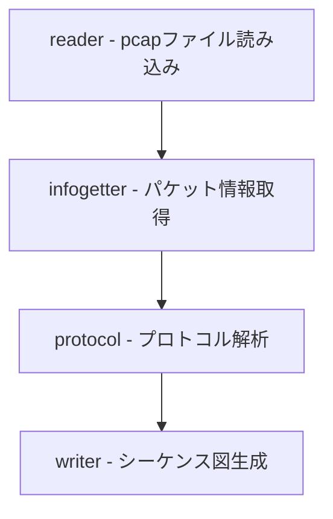
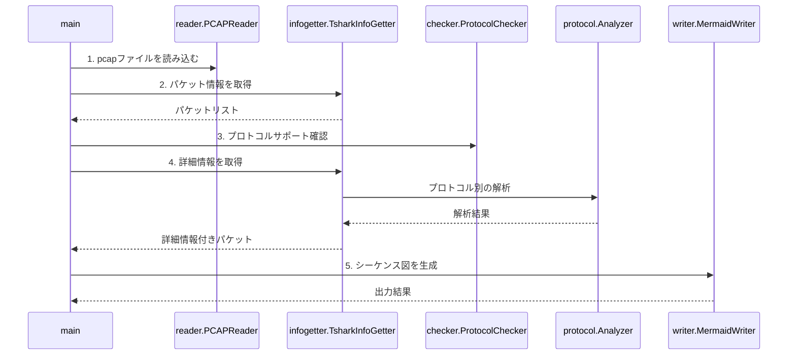

# 設計
このドキュメントは、パケットシーケンスツールの設計概要（アーキテクチャ、コンポーネント、データフロー）を提供します。  
これは、ツールの内部動作を理解し、拡張または変更したい開発者を対象としています。

## アーキテクチャ
パケットシーケンスツールは、pcapファイルをシーケンスチャートに変換するように設計されています。

### コンポーネント

### パッケージ構成
- **cmd**: メインプログラムエントリーポイント
- **reader**: pcapファイルの読み込みを担当
- **infogetter**: tsharkを使ったパケット情報の取得
- **protocol**: 各プロトコル固有の解析ロジック
- **models**: データモデル定義
- **writer**: シーケンス図生成と出力
- **checker**: プロトコルサポート状況の確認
- **config**: 設定ファイル関連

### データフロー
1. **pcapファイルの読み込み**  
   `reader`パッケージはpcapファイルの存在確認を行います。

2. **パケット情報の抽出**  
   `infogetter`パッケージはtsharkを使用して、pcapファイルからパケット情報を抽出します。
   送信元、送信先、プロトコルなどの基本情報を取得します。

3. **プロトコル固有の解析**  
   `protocol`パッケージ内の各プロトコルアナライザーが、パケットの詳細情報を解析します。

4. **Mermaid図の生成**  
   `writer`パッケージがMermaid形式でシーケンス図を生成します。

5. **ファイル出力**  
   生成されたMermaidコンテンツがMarkdownファイルに出力されます。

