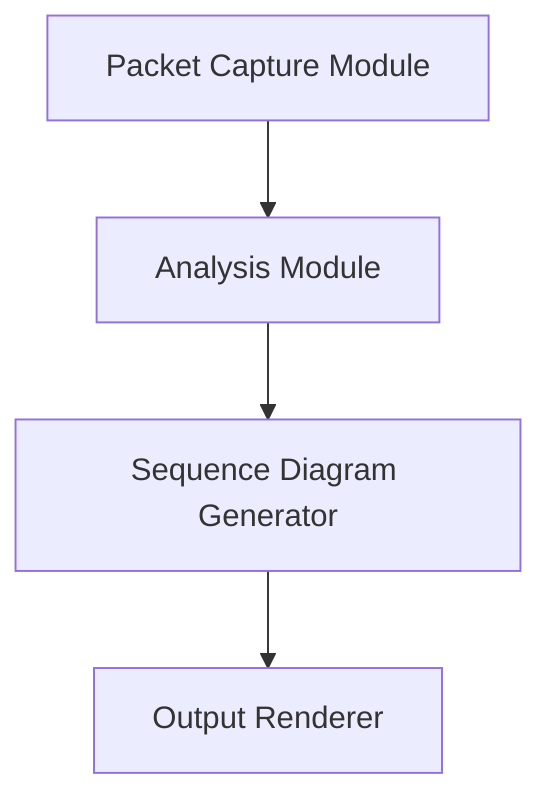
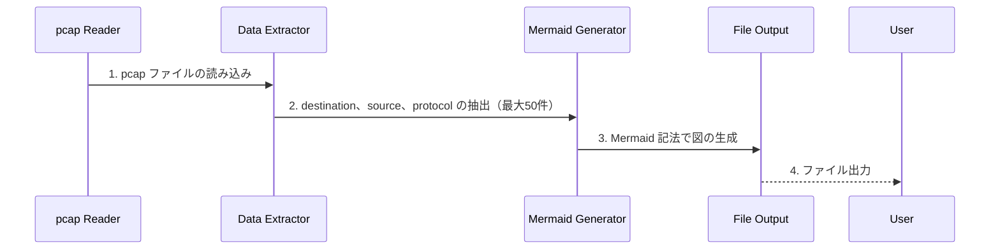

# 設計書
このドキュメントは、packet_sequence ツールの設計概要を提供し、そのアーキテクチャ、コンポーネント、及びデータフローについて説明します。  
ツールの内部動作の理解や拡張・修正を行う開発者を対象としています。

## アーキテクチャ
packet_sequence ツールは、tcpdump ファイルをシーケンスチャートに変換するために設計されています。

### コンポーネント

### データフロー
1. **pcap ファイルの読み込み**  
   ツールは pcap ファイルからデータを読み込みます。

2. **データ抽出**  
   pcap ファイルから destination、source、protocol などの情報を抽出します。  
   このプロセスは、出力ファイルごとに最大50件のエントリを抽出し、ファイルの終わりまで続けられます。  
   将来的なアップデートでは、抽出するパラメーターの選択や追加が可能になる予定です。

3. **Mermaid 記法による図の生成**  
   抽出された情報を使用して、Mermaid 記法でシーケンス図を生成します。

4. **ファイル出力**  
   生成された Mermaid コンテンツをファイルに出力します。

## X.25プロトコル解析対応
- src/protocol_analyzer/x25.py に AnalyzeX25 クラスを追加し、
  X.25固有のフィールド(DLCIなど)を解析できるようにしました。
- DiscriminateProtocol内で該当レイヤー(x25)を検出した場合、
  AnalyzeX25 を使用して詳細を抽出する設計になっています。