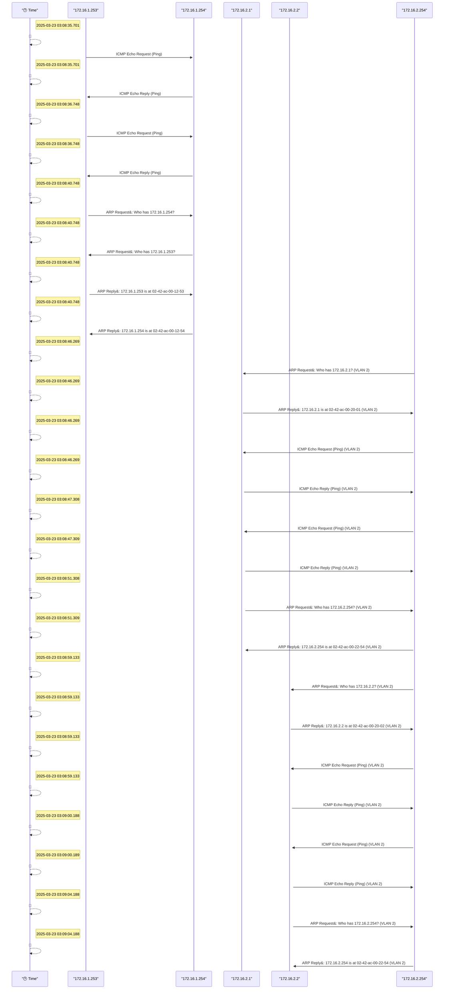

```mermaid
sequenceDiagram
    participant Time as "🕒 Time"
    participant n172_16_1_253 as "172.16.1.253"
    participant n172_16_1_254 as "172.16.1.254"
    participant n172_16_2_1 as "172.16.2.1"
    participant n172_16_2_2 as "172.16.2.2"
    participant n172_16_2_254 as "172.16.2.254"
    Note right of Time: 2025-03-23 03:08:35.701
    Time-->>Time: 📍
    n172_16_1_253->>+n172_16_1_254: ICMP Echo Request (Ping)
    Note right of Time: 2025-03-23 03:08:35.701
    Time-->>Time: 📍
    n172_16_1_254->>+n172_16_1_253: ICMP Echo Reply (Ping)
    Note right of Time: 2025-03-23 03:08:36.748
    Time-->>Time: 📍
    n172_16_1_253->>+n172_16_1_254: ICMP Echo Request (Ping)
    Note right of Time: 2025-03-23 03:08:36.748
    Time-->>Time: 📍
    n172_16_1_254->>+n172_16_1_253: ICMP Echo Reply (Ping)
    Note right of Time: 2025-03-23 03:08:40.748
    Time-->>Time: 📍
    n172_16_1_253->>+n172_16_1_254: ARP Request&#58; Who has 172.16.1.254?
    Note right of Time: 2025-03-23 03:08:40.748
    Time-->>Time: 📍
    n172_16_1_254->>+n172_16_1_253: ARP Request&#58; Who has 172.16.1.253?
    Note right of Time: 2025-03-23 03:08:40.748
    Time-->>Time: 📍
    n172_16_1_253->>+n172_16_1_254: ARP Reply&#58; 172.16.1.253 is at 02-42-ac-00-12-53
    Note right of Time: 2025-03-23 03:08:40.748
    Time-->>Time: 📍
    n172_16_1_254->>+n172_16_1_253: ARP Reply&#58; 172.16.1.254 is at 02-42-ac-00-12-54
    Note right of Time: 2025-03-23 03:08:46.269
    Time-->>Time: 📍
    n172_16_2_254->>+n172_16_2_1: ARP Request&#58; Who has 172.16.2.1? (VLAN 2)
    Note right of Time: 2025-03-23 03:08:46.269
    Time-->>Time: 📍
    n172_16_2_1->>+n172_16_2_254: ARP Reply&#58; 172.16.2.1 is at 02-42-ac-00-20-01 (VLAN 2)
    Note right of Time: 2025-03-23 03:08:46.269
    Time-->>Time: 📍
    n172_16_2_254->>+n172_16_2_1: ICMP Echo Request (Ping) (VLAN 2)
    Note right of Time: 2025-03-23 03:08:46.269
    Time-->>Time: 📍
    n172_16_2_1->>+n172_16_2_254: ICMP Echo Reply (Ping) (VLAN 2)
    Note right of Time: 2025-03-23 03:08:47.308
    Time-->>Time: 📍
    n172_16_2_254->>+n172_16_2_1: ICMP Echo Request (Ping) (VLAN 2)
    Note right of Time: 2025-03-23 03:08:47.309
    Time-->>Time: 📍
    n172_16_2_1->>+n172_16_2_254: ICMP Echo Reply (Ping) (VLAN 2)
    Note right of Time: 2025-03-23 03:08:51.308
    Time-->>Time: 📍
    n172_16_2_1->>+n172_16_2_254: ARP Request&#58; Who has 172.16.2.254? (VLAN 2)
    Note right of Time: 2025-03-23 03:08:51.309
    Time-->>Time: 📍
    n172_16_2_254->>+n172_16_2_1: ARP Reply&#58; 172.16.2.254 is at 02-42-ac-00-22-54 (VLAN 2)
    Note right of Time: 2025-03-23 03:08:59.133
    Time-->>Time: 📍
    n172_16_2_254->>+n172_16_2_2: ARP Request&#58; Who has 172.16.2.2? (VLAN 2)
    Note right of Time: 2025-03-23 03:08:59.133
    Time-->>Time: 📍
    n172_16_2_2->>+n172_16_2_254: ARP Reply&#58; 172.16.2.2 is at 02-42-ac-00-20-02 (VLAN 2)
    Note right of Time: 2025-03-23 03:08:59.133
    Time-->>Time: 📍
    n172_16_2_254->>+n172_16_2_2: ICMP Echo Request (Ping) (VLAN 2)
    Note right of Time: 2025-03-23 03:08:59.133
    Time-->>Time: 📍
    n172_16_2_2->>+n172_16_2_254: ICMP Echo Reply (Ping) (VLAN 2)
    Note right of Time: 2025-03-23 03:09:00.188
    Time-->>Time: 📍
    n172_16_2_254->>+n172_16_2_2: ICMP Echo Request (Ping) (VLAN 2)
    Note right of Time: 2025-03-23 03:09:00.189
    Time-->>Time: 📍
    n172_16_2_2->>+n172_16_2_254: ICMP Echo Reply (Ping) (VLAN 2)
    Note right of Time: 2025-03-23 03:09:04.188
    Time-->>Time: 📍
    n172_16_2_2->>+n172_16_2_254: ARP Request&#58; Who has 172.16.2.254? (VLAN 2)
    Note right of Time: 2025-03-23 03:09:04.188
    Time-->>Time: 📍
    n172_16_2_254->>+n172_16_2_2: ARP Reply&#58; 172.16.2.254 is at 02-42-ac-00-22-54 (VLAN 2)
```
