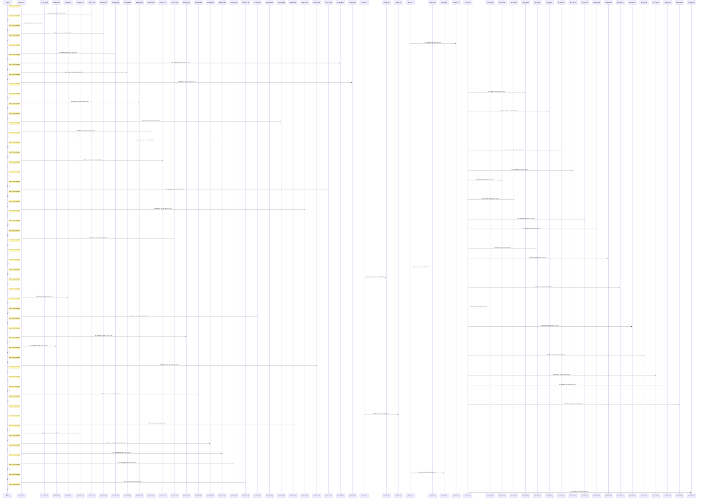

```mermaid
sequenceDiagram
    participant Time as "🕒 Time"
    participant n24_166_172_1 as "24.166.172.1"
    participant n24_166_172_141 as "24.166.172.141"
    participant n24_166_172_232 as "24.166.172.232"
    participant n24_166_172_6 as "24.166.172.6"
    participant n24_166_172_97 as "24.166.172.97"
    participant n24_166_173_159 as "24.166.173.159"
    participant n24_166_173_161 as "24.166.173.161"
    participant n24_166_173_163 as "24.166.173.163"
    participant n24_166_173_165 as "24.166.173.165"
    participant n24_166_173_168 as "24.166.173.168"
    participant n24_166_173_169 as "24.166.173.169"
    participant n24_166_173_172 as "24.166.173.172"
    participant n24_166_173_176 as "24.166.173.176"
    participant n24_166_173_181 as "24.166.173.181"
    participant n24_166_173_183 as "24.166.173.183"
    participant n24_166_173_185 as "24.166.173.185"
    participant n24_166_173_186 as "24.166.173.186"
    participant n24_166_173_188 as "24.166.173.188"
    participant n24_166_173_189 as "24.166.173.189"
    participant n24_166_174_177 as "24.166.174.177"
    participant n24_166_174_181 as "24.166.174.181"
    participant n24_166_174_184 as "24.166.174.184"
    participant n24_166_174_192 as "24.166.174.192"
    participant n24_166_174_207 as "24.166.174.207"
    participant n24_166_174_208 as "24.166.174.208"
    participant n24_166_174_221 as "24.166.174.221"
    participant n24_166_175_123 as "24.166.175.123"
    participant n24_166_175_82 as "24.166.175.82"
    participant n65_26_92_1 as "65.26.92.1"
    participant n65_26_92_195 as "65.26.92.195"
    participant n65_26_94_73 as "65.26.94.73"
    participant n65_28_78_1 as "65.28.78.1"
    participant n65_28_78_114 as "65.28.78.114"
    participant n65_28_78_134 as "65.28.78.134"
    participant n65_28_78_76 as "65.28.78.76"
    participant n69_76_216_1 as "69.76.216.1"
    participant n69_76_216_28 as "69.76.216.28"
    participant n69_76_217_186 as "69.76.217.186"
    participant n69_76_218_94 as "69.76.218.94"
    participant n69_76_220_131 as "69.76.220.131"
    participant n69_76_220_86 as "69.76.220.86"
    participant n69_76_221_27 as "69.76.221.27"
    participant n69_76_223_216 as "69.76.223.216"
    participant n69_76_223_217 as "69.76.223.217"
    participant n69_76_223_222 as "69.76.223.222"
    participant n69_76_223_223 as "69.76.223.223"
    participant n69_76_223_224 as "69.76.223.224"
    participant n69_76_223_230 as "69.76.223.230"
    participant n69_76_223_231 as "69.76.223.231"
    participant n69_76_223_232 as "69.76.223.232"
    participant n69_76_223_234 as "69.76.223.234"
    participant n69_76_223_235 as "69.76.223.235"
    participant n69_76_223_236 as "69.76.223.236"
    participant n69_76_223_249 as "69.76.223.249"
    Note right of Time: 2004-10-05 14:01:05.275
    Time-->>Time: 📍
    n24_166_172_1->>+n24_166_173_159: ARP Request&#58; Who has 24.166.173.159?
    Note right of Time: 2004-10-05 14:01:05.373
    Time-->>Time: 📍
    n24_166_172_1->>+n24_166_172_141: ARP Request&#58; Who has 24.166.172.141?
    Note right of Time: 2004-10-05 14:01:05.385
    Time-->>Time: 📍
    n24_166_172_1->>+n24_166_173_161: ARP Request&#58; Who has 24.166.173.161?
    Note right of Time: 2004-10-05 14:01:05.487
    Time-->>Time: 📍
    n65_28_78_1->>+n65_28_78_76: ARP Request&#58; Who has 65.28.78.76?
    Note right of Time: 2004-10-05 14:01:05.492
    Time-->>Time: 📍
    n24_166_172_1->>+n24_166_173_163: ARP Request&#58; Who has 24.166.173.163?
    Note right of Time: 2004-10-05 14:01:05.583
    Time-->>Time: 📍
    n24_166_172_1->>+n24_166_175_123: ARP Request&#58; Who has 24.166.175.123?
    Note right of Time: 2004-10-05 14:01:05.605
    Time-->>Time: 📍
    n24_166_172_1->>+n24_166_173_165: ARP Request&#58; Who has 24.166.173.165?
    Note right of Time: 2004-10-05 14:01:05.683
    Time-->>Time: 📍
    n24_166_172_1->>+n24_166_175_82: ARP Request&#58; Who has 24.166.175.82?
    Note right of Time: 2004-10-05 14:01:05.730
    Time-->>Time: 📍
    n69_76_216_1->>+n69_76_220_131: ARP Request&#58; Who has 69.76.220.131?
    Note right of Time: 2004-10-05 14:01:05.762
    Time-->>Time: 📍
    n24_166_172_1->>+n24_166_173_168: ARP Request&#58; Who has 24.166.173.168?
    Note right of Time: 2004-10-05 14:01:05.780
    Time-->>Time: 📍
    n69_76_216_1->>+n69_76_221_27: ARP Request&#58; Who has 69.76.221.27?
    Note right of Time: 2004-10-05 14:01:05.786
    Time-->>Time: 📍
    n24_166_172_1->>+n24_166_174_184: ARP Request&#58; Who has 24.166.174.184?
    Note right of Time: 2004-10-05 14:01:05.816
    Time-->>Time: 📍
    n24_166_172_1->>+n24_166_173_169: ARP Request&#58; Who has 24.166.173.169?
    Note right of Time: 2004-10-05 14:01:05.862
    Time-->>Time: 📍
    n24_166_172_1->>+n24_166_174_181: ARP Request&#58; Who has 24.166.174.181?
    Note right of Time: 2004-10-05 14:01:05.938
    Time-->>Time: 📍
    n69_76_216_1->>+n69_76_223_216: ARP Request&#58; Who has 69.76.223.216?
    Note right of Time: 2004-10-05 14:01:05.965
    Time-->>Time: 📍
    n24_166_172_1->>+n24_166_173_172: ARP Request&#58; Who has 24.166.173.172?
    Note right of Time: 2004-10-05 14:01:05.968
    Time-->>Time: 📍
    n69_76_216_1->>+n69_76_223_217: ARP Request&#58; Who has 69.76.223.217?
    Note right of Time: 2004-10-05 14:01:06.046
    Time-->>Time: 📍
    n69_76_216_1->>+n69_76_217_186: ARP Request&#58; Who has 69.76.217.186?
    Note right of Time: 2004-10-05 14:01:06.067
    Time-->>Time: 📍
    n24_166_172_1->>+n24_166_174_221: ARP Request&#58; Who has 24.166.174.221?
    Note right of Time: 2004-10-05 14:01:06.076
    Time-->>Time: 📍
    n69_76_216_1->>+n69_76_218_94: ARP Request&#58; Who has 69.76.218.94?
    Note right of Time: 2004-10-05 14:01:06.081
    Time-->>Time: 📍
    n24_166_172_1->>+n24_166_174_207: ARP Request&#58; Who has 24.166.174.207?
    Note right of Time: 2004-10-05 14:01:06.132
    Time-->>Time: 📍
    n69_76_216_1->>+n69_76_223_222: ARP Request&#58; Who has 69.76.223.222?
    Note right of Time: 2004-10-05 14:01:06.159
    Time-->>Time: 📍
    n69_76_216_1->>+n69_76_223_223: ARP Request&#58; Who has 69.76.223.223?
    Note right of Time: 2004-10-05 14:01:06.172
    Time-->>Time: 📍
    n24_166_172_1->>+n24_166_173_176: ARP Request&#58; Who has 24.166.173.176?
    Note right of Time: 2004-10-05 14:01:06.206
    Time-->>Time: 📍
    n69_76_216_1->>+n69_76_220_86: ARP Request&#58; Who has 69.76.220.86?
    Note right of Time: 2004-10-05 14:01:06.207
    Time-->>Time: 📍
    n69_76_216_1->>+n69_76_223_224: ARP Request&#58; Who has 69.76.223.224?
    Note right of Time: 2004-10-05 14:01:06.338
    Time-->>Time: 📍
    n65_28_78_1->>+n65_28_78_114: ARP Request&#58; Who has 65.28.78.114?
    Note right of Time: 2004-10-05 14:01:06.340
    Time-->>Time: 📍
    n65_26_92_1->>+n65_26_92_195: ARP Request&#58; Who has 65.26.92.195?
    Note right of Time: 2004-10-05 14:01:06.379
    Time-->>Time: 📍
    n69_76_216_1->>+n69_76_223_230: ARP Request&#58; Who has 69.76.223.230?
    Note right of Time: 2004-10-05 14:01:06.380
    Time-->>Time: 📍
    n24_166_172_1->>+n24_166_172_6: ARP Request&#58; Who has 24.166.172.6?
    Note right of Time: 2004-10-05 14:01:06.406
    Time-->>Time: 📍
    n69_76_216_1->>+n69_76_216_28: ARP Request&#58; Who has 69.76.216.28?
    Note right of Time: 2004-10-05 14:01:06.408
    Time-->>Time: 📍
    n24_166_172_1->>+n24_166_174_177: ARP Request&#58; Who has 24.166.174.177?
    Note right of Time: 2004-10-05 14:01:06.409
    Time-->>Time: 📍
    n69_76_216_1->>+n69_76_223_231: ARP Request&#58; Who has 69.76.223.231?
    Note right of Time: 2004-10-05 14:01:06.427
    Time-->>Time: 📍
    n24_166_172_1->>+n24_166_173_181: ARP Request&#58; Who has 24.166.173.181?
    Note right of Time: 2004-10-05 14:01:06.457
    Time-->>Time: 📍
    n24_166_172_1->>+n24_166_172_232: ARP Request&#58; Who has 24.166.172.232?
    Note right of Time: 2004-10-05 14:01:06.459
    Time-->>Time: 📍
    n69_76_216_1->>+n69_76_223_232: ARP Request&#58; Who has 69.76.223.232?
    Note right of Time: 2004-10-05 14:01:06.482
    Time-->>Time: 📍
    n24_166_172_1->>+n24_166_174_208: ARP Request&#58; Who has 24.166.174.208?
    Note right of Time: 2004-10-05 14:01:06.499
    Time-->>Time: 📍
    n69_76_216_1->>+n69_76_223_234: ARP Request&#58; Who has 69.76.223.234?
    Note right of Time: 2004-10-05 14:01:06.529
    Time-->>Time: 📍
    n69_76_216_1->>+n69_76_223_235: ARP Request&#58; Who has 69.76.223.235?
    Note right of Time: 2004-10-05 14:01:06.539
    Time-->>Time: 📍
    n24_166_172_1->>+n24_166_173_183: ARP Request&#58; Who has 24.166.173.183?
    Note right of Time: 2004-10-05 14:01:06.567
    Time-->>Time: 📍
    n69_76_216_1->>+n69_76_223_236: ARP Request&#58; Who has 69.76.223.236?
    Note right of Time: 2004-10-05 14:01:06.576
    Time-->>Time: 📍
    n65_26_92_1->>+n65_26_94_73: ARP Request&#58; Who has 65.26.94.73?
    Note right of Time: 2004-10-05 14:01:06.581
    Time-->>Time: 📍
    n24_166_172_1->>+n24_166_174_192: ARP Request&#58; Who has 24.166.174.192?
    Note right of Time: 2004-10-05 14:01:06.614
    Time-->>Time: 📍
    n24_166_172_1->>+n24_166_172_97: ARP Request&#58; Who has 24.166.172.97?
    Note right of Time: 2004-10-05 14:01:06.650
    Time-->>Time: 📍
    n24_166_172_1->>+n24_166_173_185: ARP Request&#58; Who has 24.166.173.185?
    Note right of Time: 2004-10-05 14:01:06.704
    Time-->>Time: 📍
    n24_166_172_1->>+n24_166_173_186: ARP Request&#58; Who has 24.166.173.186?
    Note right of Time: 2004-10-05 14:01:06.812
    Time-->>Time: 📍
    n24_166_172_1->>+n24_166_173_188: ARP Request&#58; Who has 24.166.173.188?
    Note right of Time: 2004-10-05 14:01:06.842
    Time-->>Time: 📍
    n65_28_78_1->>+n65_28_78_134: ARP Request&#58; Who has 65.28.78.134?
    Note right of Time: 2004-10-05 14:01:06.866
    Time-->>Time: 📍
    n24_166_172_1->>+n24_166_173_189: ARP Request&#58; Who has 24.166.173.189?
    Note right of Time: 2004-10-05 14:01:07.018
    Time-->>Time: 📍
    n69_76_216_1->>+n69_76_223_249: ARP Request&#58; Who has 69.76.223.249?
```
