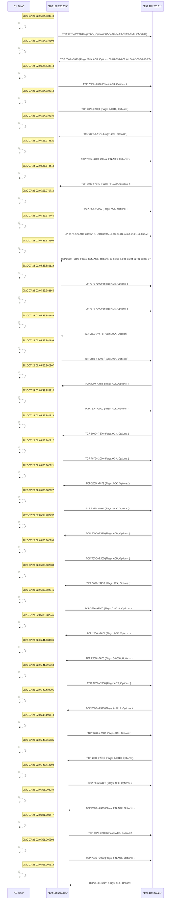

```mermaid
sequenceDiagram
    participant Time as "🕒 Time"
    participant n192.168.200.135 as "192.168.200.135"
    participant n192.168.200.21 as "192.168.200.21"
    Note right of Time: 2020-07-23 02:05:24.234640
    Time-->>Time: 📍
    n192.168.200.135->>+n192.168.200.21: TCP 7875->2000 (Flags: SYN, Options: 02-04-05-b4-01-03:03-08-01-01-04-02)
    Note right of Time: 2020-07-23 02:05:24.234693
    Time-->>Time: 📍
    n192.168.200.21->>+n192.168.200.135: TCP 2000->7875 (Flags: SYN,ACK, Options: 02-04-05-b4-01-01:04-02-01-03-03-07)
    Note right of Time: 2020-07-23 02:05:24.239213
    Time-->>Time: 📍
    n192.168.200.135->>+n192.168.200.21: TCP 7875->2000 (Flags: ACK, Options: )
    Note right of Time: 2020-07-23 02:05:24.239318
    Time-->>Time: 📍
    n192.168.200.135->>+n192.168.200.21: TCP 7875->2000 (Flags: 0x0018, Options: )
    Note right of Time: 2020-07-23 02:05:24.239330
    Time-->>Time: 📍
    n192.168.200.21->>+n192.168.200.135: TCP 2000->7875 (Flags: ACK, Options: )
    Note right of Time: 2020-07-23 02:05:26.973121
    Time-->>Time: 📍
    n192.168.200.135->>+n192.168.200.21: TCP 7875->2000 (Flags: FIN,ACK, Options: )
    Note right of Time: 2020-07-23 02:05:26.973315
    Time-->>Time: 📍
    n192.168.200.21->>+n192.168.200.135: TCP 2000->7875 (Flags: FIN,ACK, Options: )
    Note right of Time: 2020-07-23 02:05:26.976710
    Time-->>Time: 📍
    n192.168.200.135->>+n192.168.200.21: TCP 7875->2000 (Flags: ACK, Options: )
    Note right of Time: 2020-07-23 02:05:33.276465
    Time-->>Time: 📍
    n192.168.200.135->>+n192.168.200.21: TCP 7876->2000 (Flags: SYN, Options: 02-04-05-b4-01-03:03-08-01-01-04-02)
    Note right of Time: 2020-07-23 02:05:33.276505
    Time-->>Time: 📍
    n192.168.200.21->>+n192.168.200.135: TCP 2000->7876 (Flags: SYN,ACK, Options: 02-04-05-b4-01-01:04-02-01-03-03-07)
    Note right of Time: 2020-07-23 02:05:33.282129
    Time-->>Time: 📍
    n192.168.200.135->>+n192.168.200.21: TCP 7876->2000 (Flags: ACK, Options: )
    Note right of Time: 2020-07-23 02:05:33.282166
    Time-->>Time: 📍
    n192.168.200.135->>+n192.168.200.21: TCP 7876->2000 (Flags: ACK, Options: )
    Note right of Time: 2020-07-23 02:05:33.282183
    Time-->>Time: 📍
    n192.168.200.21->>+n192.168.200.135: TCP 2000->7876 (Flags: ACK, Options: )
    Note right of Time: 2020-07-23 02:05:33.282199
    Time-->>Time: 📍
    n192.168.200.135->>+n192.168.200.21: TCP 7876->2000 (Flags: ACK, Options: )
    Note right of Time: 2020-07-23 02:05:33.282207
    Time-->>Time: 📍
    n192.168.200.21->>+n192.168.200.135: TCP 2000->7876 (Flags: ACK, Options: )
    Note right of Time: 2020-07-23 02:05:33.282210
    Time-->>Time: 📍
    n192.168.200.135->>+n192.168.200.21: TCP 7876->2000 (Flags: ACK, Options: )
    Note right of Time: 2020-07-23 02:05:33.282214
    Time-->>Time: 📍
    n192.168.200.21->>+n192.168.200.135: TCP 2000->7876 (Flags: ACK, Options: )
    Note right of Time: 2020-07-23 02:05:33.282217
    Time-->>Time: 📍
    n192.168.200.135->>+n192.168.200.21: TCP 7876->2000 (Flags: ACK, Options: )
    Note right of Time: 2020-07-23 02:05:33.282221
    Time-->>Time: 📍
    n192.168.200.21->>+n192.168.200.135: TCP 2000->7876 (Flags: ACK, Options: )
    Note right of Time: 2020-07-23 02:05:33.282227
    Time-->>Time: 📍
    n192.168.200.135->>+n192.168.200.21: TCP 7876->2000 (Flags: ACK, Options: )
    Note right of Time: 2020-07-23 02:05:33.282232
    Time-->>Time: 📍
    n192.168.200.21->>+n192.168.200.135: TCP 2000->7876 (Flags: ACK, Options: )
    Note right of Time: 2020-07-23 02:05:33.282235
    Time-->>Time: 📍
    n192.168.200.135->>+n192.168.200.21: TCP 7876->2000 (Flags: ACK, Options: )
    Note right of Time: 2020-07-23 02:05:33.282238
    Time-->>Time: 📍
    n192.168.200.21->>+n192.168.200.135: TCP 2000->7876 (Flags: ACK, Options: )
    Note right of Time: 2020-07-23 02:05:33.282241
    Time-->>Time: 📍
    n192.168.200.135->>+n192.168.200.21: TCP 7876->2000 (Flags: 0x0018, Options: )
    Note right of Time: 2020-07-23 02:05:33.282245
    Time-->>Time: 📍
    n192.168.200.21->>+n192.168.200.135: TCP 2000->7876 (Flags: ACK, Options: )
    Note right of Time: 2020-07-23 02:05:41.933906
    Time-->>Time: 📍
    n192.168.200.21->>+n192.168.200.135: TCP 2000->7876 (Flags: 0x0018, Options: )
    Note right of Time: 2020-07-23 02:05:41.991563
    Time-->>Time: 📍
    n192.168.200.135->>+n192.168.200.21: TCP 7876->2000 (Flags: ACK, Options: )
    Note right of Time: 2020-07-23 02:05:43.439205
    Time-->>Time: 📍
    n192.168.200.21->>+n192.168.200.135: TCP 2000->7876 (Flags: 0x0018, Options: )
    Note right of Time: 2020-07-23 02:05:43.496713
    Time-->>Time: 📍
    n192.168.200.135->>+n192.168.200.21: TCP 7876->2000 (Flags: ACK, Options: )
    Note right of Time: 2020-07-23 02:05:45.661735
    Time-->>Time: 📍
    n192.168.200.21->>+n192.168.200.135: TCP 2000->7876 (Flags: 0x0018, Options: )
    Note right of Time: 2020-07-23 02:05:45.714692
    Time-->>Time: 📍
    n192.168.200.135->>+n192.168.200.21: TCP 7876->2000 (Flags: ACK, Options: )
    Note right of Time: 2020-07-23 02:05:51.902034
    Time-->>Time: 📍
    n192.168.200.21->>+n192.168.200.135: TCP 2000->7876 (Flags: FIN,ACK, Options: )
    Note right of Time: 2020-07-23 02:05:51.905577
    Time-->>Time: 📍
    n192.168.200.135->>+n192.168.200.21: TCP 7876->2000 (Flags: ACK, Options: )
    Note right of Time: 2020-07-23 02:05:51.905598
    Time-->>Time: 📍
    n192.168.200.135->>+n192.168.200.21: TCP 7876->2000 (Flags: FIN,ACK, Options: )
    Note right of Time: 2020-07-23 02:05:51.905618
    Time-->>Time: 📍
    n192.168.200.21->>+n192.168.200.135: TCP 2000->7876 (Flags: ACK, Options: )
```