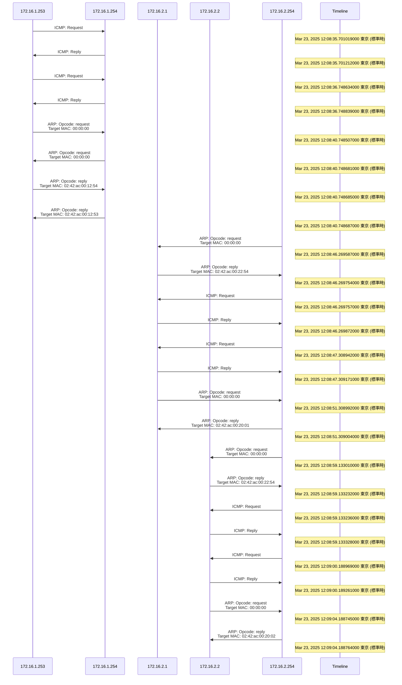

# パケットシーケンス図

```mermaid
sequenceDiagram
    participant 172.16.1.253
    participant 172.16.1.254
    participant 172.16.2.1
    participant 172.16.2.2
    participant 172.16.2.254
    172.16.1.253->>172.16.1.254: ICMP: Request
    Note over Timeline: Mar 23, 2025 12:08:35.701019000 東京 (標準時)
    172.16.1.254->>172.16.1.253: ICMP: Reply
    Note over Timeline: Mar 23, 2025 12:08:35.701212000 東京 (標準時)
    172.16.1.253->>172.16.1.254: ICMP: Request
    Note over Timeline: Mar 23, 2025 12:08:36.748634000 東京 (標準時)
    172.16.1.254->>172.16.1.253: ICMP: Reply
    Note over Timeline: Mar 23, 2025 12:08:36.748839000 東京 (標準時)
    172.16.1.253->>172.16.1.254: ARP: Opcode: request<br>Target MAC: 00:00:00
    Note over Timeline: Mar 23, 2025 12:08:40.748507000 東京 (標準時)
    172.16.1.254->>172.16.1.253: ARP: Opcode: request<br>Target MAC: 00:00:00
    Note over Timeline: Mar 23, 2025 12:08:40.748681000 東京 (標準時)
    172.16.1.253->>172.16.1.254: ARP: Opcode: reply<br>Target MAC: 02:42:ac:00:12:54
    Note over Timeline: Mar 23, 2025 12:08:40.748685000 東京 (標準時)
    172.16.1.254->>172.16.1.253: ARP: Opcode: reply<br>Target MAC: 02:42:ac:00:12:53
    Note over Timeline: Mar 23, 2025 12:08:40.748687000 東京 (標準時)
    172.16.2.254->>172.16.2.1: ARP: Opcode: request<br>Target MAC: 00:00:00
    Note over Timeline: Mar 23, 2025 12:08:46.269587000 東京 (標準時)
    172.16.2.1->>172.16.2.254: ARP: Opcode: reply<br>Target MAC: 02:42:ac:00:22:54
    Note over Timeline: Mar 23, 2025 12:08:46.269754000 東京 (標準時)
    172.16.2.254->>172.16.2.1: ICMP: Request
    Note over Timeline: Mar 23, 2025 12:08:46.269757000 東京 (標準時)
    172.16.2.1->>172.16.2.254: ICMP: Reply
    Note over Timeline: Mar 23, 2025 12:08:46.269872000 東京 (標準時)
    172.16.2.254->>172.16.2.1: ICMP: Request
    Note over Timeline: Mar 23, 2025 12:08:47.308942000 東京 (標準時)
    172.16.2.1->>172.16.2.254: ICMP: Reply
    Note over Timeline: Mar 23, 2025 12:08:47.309171000 東京 (標準時)
    172.16.2.1->>172.16.2.254: ARP: Opcode: request<br>Target MAC: 00:00:00
    Note over Timeline: Mar 23, 2025 12:08:51.308992000 東京 (標準時)
    172.16.2.254->>172.16.2.1: ARP: Opcode: reply<br>Target MAC: 02:42:ac:00:20:01
    Note over Timeline: Mar 23, 2025 12:08:51.309004000 東京 (標準時)
    172.16.2.254->>172.16.2.2: ARP: Opcode: request<br>Target MAC: 00:00:00
    Note over Timeline: Mar 23, 2025 12:08:59.133010000 東京 (標準時)
    172.16.2.2->>172.16.2.254: ARP: Opcode: reply<br>Target MAC: 02:42:ac:00:22:54
    Note over Timeline: Mar 23, 2025 12:08:59.133232000 東京 (標準時)
    172.16.2.254->>172.16.2.2: ICMP: Request
    Note over Timeline: Mar 23, 2025 12:08:59.133236000 東京 (標準時)
    172.16.2.2->>172.16.2.254: ICMP: Reply
    Note over Timeline: Mar 23, 2025 12:08:59.133328000 東京 (標準時)
    172.16.2.254->>172.16.2.2: ICMP: Request
    Note over Timeline: Mar 23, 2025 12:09:00.188969000 東京 (標準時)
    172.16.2.2->>172.16.2.254: ICMP: Reply
    Note over Timeline: Mar 23, 2025 12:09:00.189261000 東京 (標準時)
    172.16.2.2->>172.16.2.254: ARP: Opcode: request<br>Target MAC: 00:00:00
    Note over Timeline: Mar 23, 2025 12:09:04.188745000 東京 (標準時)
    172.16.2.254->>172.16.2.2: ARP: Opcode: reply<br>Target MAC: 02:42:ac:00:20:02
    Note over Timeline: Mar 23, 2025 12:09:04.188764000 東京 (標準時)
```
